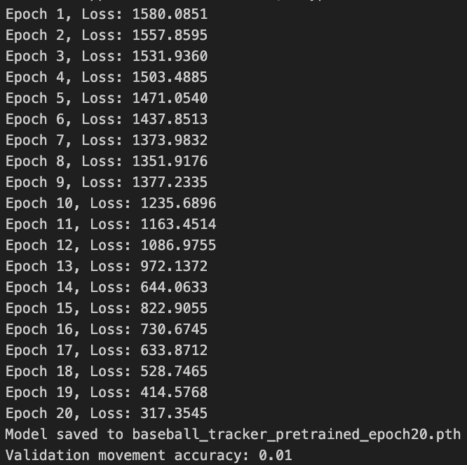

# **Hey Batta Batta... _Train a Neural Network_**
### ECON 8310 Semester Project
### Presented by _Aziz, Qi Qi, and Joe_

---

# How it started...

---

# How it ended...

---

# Model Debrief

- Did we generate a model? :white_check_mark:
- Did it produce results? :white_check_mark:
- Was it a good model? :sweat_smile:

**Overall:** Our model was far from perfect...

---

# Project Obstacles 

Our challenges can be broken down into three categories:

1. Data engineering
2. Model training
3. Model evaluation 

---

# Data engineering
Most difficult part of the project

- Misalignment between videos and annotations (indexing errors)
- Inconsistent annotations 
- Dataset & batching issues (targets were in different shapes)

**Takeaway:** The brunt of the work was turning the videos and annotations into something a model could actually use

---

# Model training 
The model only works when the data pipeline works...

- Incorrect input types (float tensors vs. uint8)
- Class imbalance: "moving" data was sparse
- Training loop crashes: incorrect indexing, mismatched shapes, etc.
- Memory constraints: large frames + batch size = crash

**Takeaway:**  Get a better computer (just kidding).  _Ask for help sooner rather than later._

---

# Model evaluation

- Checkpoint loading issues (unpickling errors)
- Validation confusion: unsure where/how to build a validation data loader
- Model paramaters: understanding what information a model object gives
- How to format new input data to test the model 

**Takeaway:**  Evaluating, saving, and reloading a neural network model adds another layer of data engineering 

---

# Our Proposed Approach 

Our initial proposal was to explore tree-based models as baseline before neural networks

**What actually happened:** 

- Tree-based model implementation was not intuitive
- Opted to neural network models
  - Neural network from scratch
  - Pretrained neural network 

---

# Model Pipeline

1. Extracted frames from videos  
2. Resized frames for model efficiency  
3. Normalized pixel intensities 
4. Manually created train and validation sets  
5. Applied transformations
6. Trained the model 

---

# Modeling

**From Scratch**  
- conv layers + global avg pool + 1 linear layer
- Look → clues → look again → clues → summarize → decide
- Information must pass through each layer
- **Answering one thing:** is the baseball moving in the frame? 

**Pretrained**  
- Pretrained (ResNet18): 17 conv layers + 8 shortcuts 
- Already knows many general visual features
- **Answering two things:** where's the ball? is it moving? 

---

# From Stratch Neural Network

### Predictions
| Predicted Class | Count |
|-----------------|-------|
| 0 (Not Moving)  | 140   |
| 1 (Moving)      | 0     |
| **Total**       | **140** |

### True Class Distribution
| Class Label | Meaning    | Count |
|------------|------------|-------|
| 0          | Not Moving | 86    |
| 1          | Moving     | 54    |
| **Total**  | —          | **140** |

---

# Pretrained Neural Network

- Loss function: **Smooth L1 + Binary Cross-Entropy (BCE)**  
  - **Smooth L1:** bounding box
  - **BCE:** moving baseball
- Optimizer: **Adam**
  - Fast convergence & minimal tuning
- Learning rate: **1e-3**
  - Common default for the optimizer used
- Batch size: **8**
  - Memory constraints & small dataset

---

# Training Results

## Trained for **20 epochs**
## Movement accuracy of **1%**

### Why this probably happened...

- Limited data leading to unstable training 
- Extremely high final loss
- Underlying issues with labeling or class-index mistmach

---

# Example 1

<video width="640" height="480" controls>
    <source src="test_final1.mov" type="video/mp4">
</video>

---

# Example 2

<video width="640" height="480" controls>
    <source src="test_final2.mov" type="video/mp4">
</video>

---

# Thank you for listening!
### _Questions or commentary?_

